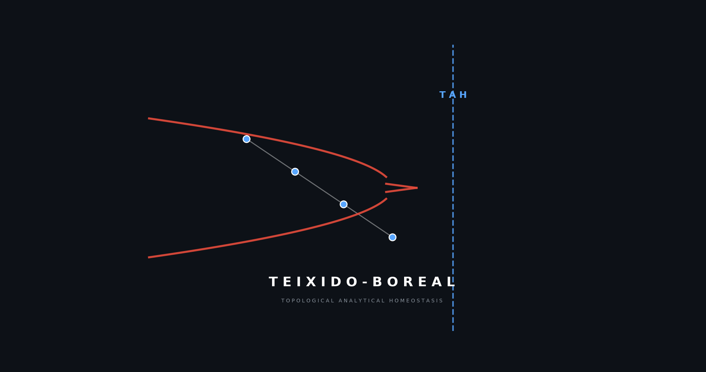

  

# Teixido-Boreal Forest (TBF): Antifragile Tropical Neural Networks

**Topological Analytical Homeostasis (TAH)** is a new computational paradigm that regulates Artificial Intelligence via the geometric roots of graph polynomials. By aligning sparse manifolds with the **Teixido Envelope**, TBF achieves intrinsic stability and noise immunity.

## 🚀 The Discovery
*   **Teixido Constant ($\tau = -0.5$):** The machine-verified accumulation limit for stable sparse topologies.
*   **Antifragility:** A documented **Stability Ratio of 1.1470**, where predictive performance (F1-Score) improves under high-magnitude environmental chaos.
*   **Zero-Multiplication Logic:** Replaces power-hungry MAC units with additive Tropical (Max-Plus) logic.

## 📊 Benchmarks (175k Events)
| Metric | Legacy Dense MLP | Teixido-Boreal (TBM) |
| :--- | :--- | :--- |
| Synaptic Density | 100% | **2.9% (Sparse)** |
| Multiplier Usage | 100% | **0.0% (Zero-MAC)** |
| Stability Ratio | 0.36 (Fragile) | **1.14 (Antifragile)** |

## ⚖️ Commercial Licensing
The Teixido-Boreal Paradigm is protected intellectual property.
- **Open Source:** Licensed under **AGPL-3.0** for non-commercial research.
- **Enterprise:** Optimized Star-Limit constants ($\epsilon$), high-performance LTN kernels, and RTL-ready VHDL/Verilog blueprints are available for commercial license.
- **Contact:** [jvteixido@liberty.edu](mailto:jvteixido@liberty.edu)
