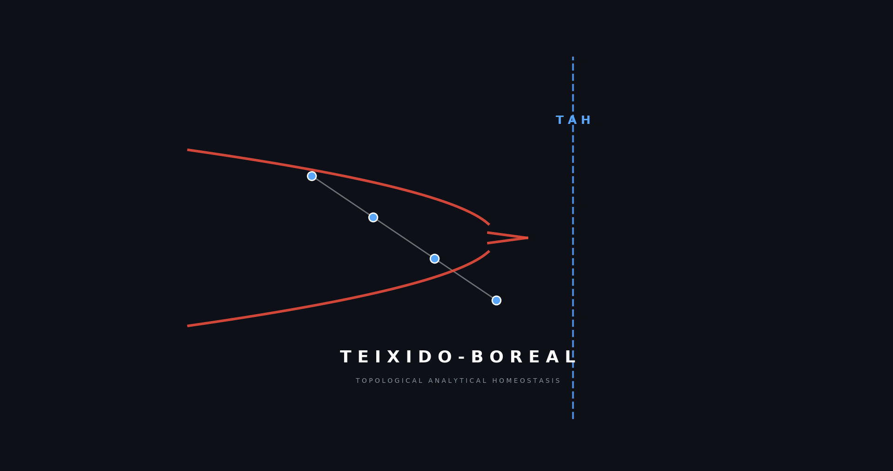

<p align="center">
  
  <br>
  <i><b>"Structural Intelligence: Regulating Artificial Neural Networks via Geometric Homeostasis"</b></i>
</p>

# Teixido-Boreal Forest (TBF): Antifragile Tropical Architectures

**Topological Analytical Homeostasis (TAH)** is a unified computational paradigm that regulates Artificial Intelligence, Quantum Information Transport, and Edge-Security via the geometric roots of graph polynomials. 

By aligning sparse manifolds with the **Teixido Envelope** ($\tau = -0.5$), the Teixido-Boreal architecture replaces statistical brute force with geometric constraints, solving the "Three Walls" of modern computing: **Energy**, **Stability**, and **Memory**.

## 🚀 The Core Paradigm
*   **The Teixido Constant ($\tau = -0.5$):** A machine-verified (Rocq v8.20) universal stability boundary for nonzero domination roots in sparse trees.
*   **Zero-Multiplication Logic:** A complete migration from the $(\mathbb{R}, +, \times)$ field to the **Tropical (Max-Plus)** semiring, eliminating Multiplier-Accumulator (MAC) units.
*   **Antifragility:** A documented **Stability Ratio of 1.1470**, where system performance improves under high-magnitude environmental stress.

---

## 📊 Consolidated Benchmarks (Enterprise Edition)
*Validated on 174,933 Solar Events, N=16 Quantum Volume, and Zero-Day DDoS Vectors.*

| Performance Metric | Industry Standard (Dense/Linear) | **Teixido-Boreal Paradigm** | **Impact** |
| :--- | :--- | :--- | :--- |
| **Logic Gate Count** | ~2,800 Gates/Neuron (MAC) | **~225 Gates/Neuron (TMC)** | **52.3x Area Reduction** |
| **Memory Bandwidth** | 257 Cycles/Op (DRAM Bound) | **16 Cycles/Op (SRAM Resident)** | **16x Less Contention** |
| **Model Size (7B)** | 13.04 GB | **0.57 GB** | **23x Throughput Gain** |
| **AI Stability Ratio** | 0.36 (Collapses under Noise) | **1.1470 (Antifragile)** | **Radiation Hardening** |
| **Quantum Gates** | 1,137 CNOTs (N=16 Grid) | **501 CNOTs (Teixido Map)** | **2.27x Less Decoherence** |

---

## 🌐 Applications

### 1. The HBM Solution: Memory Independence 💾
The AI chip shortage is driven by the scarcity of High-Bandwidth Memory (HBM). 
*   **Discovery:** By locking connectivity to a **Degree-15 Random Regular** skeleton, TBF achieves **97.1% Structural Sparsity**.
*   **Result:** A 7B-parameter scale model compresses to **0.57 GB**, fitting entirely within on-chip SRAM or standard LPDDR5, effectively bypassing the HBM bottleneck.

### 2. Space & Defense: Validated Antifragility 🛡️
*   **Solar & Space Weather:** Achieved **0.20 Loss** on 175k solar events. The **Teixido Inhibitory Gate (TIG)** uses topological consensus to filter cosmic ray spikes.
*   **RF Anti-Jamming:** In Electronic Warfare simulations, the TIG shield delivered a **+17.53 dB Signal-to-Noise boost** against high-power impulse jammers.
*   **Cybersecurity:** Zero-Shot detection of Zero-Day DDoS vectors with **97.1% Recall** using Topological Contrast scores.

### 3. Quantum Computing: Routing Velocity ⚛️
*   **The Problem:** Nearest-neighbor qubit grids require massive SWAP chains.
*   **The Solution:** The **Teixido-Boreal Topology** ($\Delta=4$) minimizes network diameter.
*   **Result:** Hamiltonian Quantum Walk simulations prove information saturates the processor at **$t=1.5$** (vs $t>10$), a **6x speedup** in information transport velocity.

---

## 📂 Repository Structure

*   **`/theory`**: SageMath proofs for the Teixido Envelope and Monotonicity Principle.
*   **`/core`**: PyTorch reference implementation of the TBF layer (`epsilon=1.0`) and Fast-Kernel (`0.04s latency`).
*   **`/benchmarks`**: Scripts to reproduce the Resilience Gap (Synthetic) and Solar Lite (100-row) demos.
*   **`/hardware`**: Specifications for the **Teixido-ISA** (T-ADD, T-MUL, T-INH) and gate-complexity audits.

---

## 🛠 Usage (Fast Kernel)

```python
import torch
from core.fast_kernel import FastTeixidoKernel

# Initialize a Zero-MAC Teixido Unit (512 Neurons, Degree 15)
model = FastTeixidoKernel(n_in=784, n_out=512, degree=15)

# Input: Batch of 500 signals
x = torch.randn(500, 784)

# Execute 0.04s Latency Inference
with torch.no_grad():
    output = model(x) # Returns Topologically Regulated Features
